# Webapp quản lý trang thông tin cá nhân

App quản lý CRUD (tạo - đọc - cập nhật - xóa) đơn giản cho project https://github.com/chi-cong/BTL-LT-Web.
Địa chỉ url của tại https://curious-kitten-11dfba.netlify.app/

## Các nội dung chính

- Các công nghệ được sử dụng
- Thông tin dữ liệu
- Giao diện và chức năng

## Các công nghệ được sử dụng

- JavaScript 12 (ECMAScript 2021)
- Thư viện React 18.1.0
- Thư viện React-icons 4.4.0
- Thư viện Tailwindcss 3.0.24
- Postcss 8.4.13

## Thông tin dữ liệu

App không kết nối trực tiếp tới web client project hay bất cứ cơ sở dữ liệu nào. Mục tiêu chính của app nhằm giả lập các chức năng cần thiết cho việc quản lý dữ liệu cho web client. Do vậy dữ liệu sẽ được lưu vào local storage.
Khi hoàn thành việc đăng nhập, app sẽ có 1 phần dữ liệu có sẵn và tự động được thêm vào nếu trong local storage chưa có dữ liệu

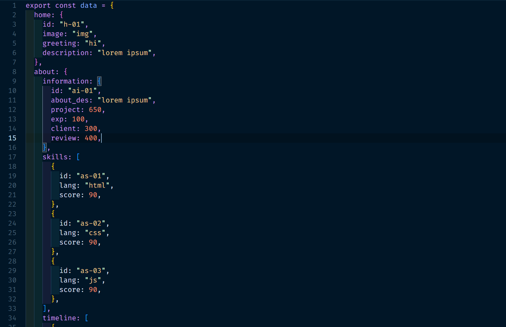

Mỗi phần dữ liệu được phần loại, được quyết định xem phần dữ liệu có thể thao tác các chức năng gì. Ví dụ mục home không cho phép thêm và xóa dữ liệu mà chỉ được đọc và sửa dữ liệu, trong khi đó phần blogs thực hiện đầy đủ 4 chức năng. Tuy nhiên với tất các phần khi sửa dữ liệu, thay đổi ID là không cho phép
Riêng với mục about sẽ có 3 mục con, các con này sẽ chức năng tương tự như khác mục lớn khác

## Giao diện và chức năng

Giao sẽ có tất cả 3 trang lớn

### Trang đăng nhập

Giao diện trên màn hình 24 inch

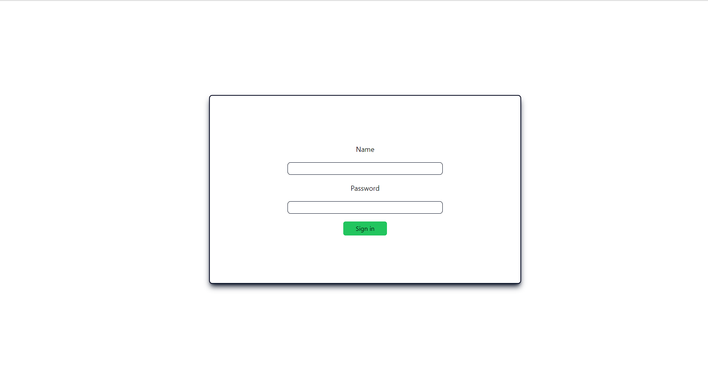

Giao diện điện thoại trên Iphone 12 pro

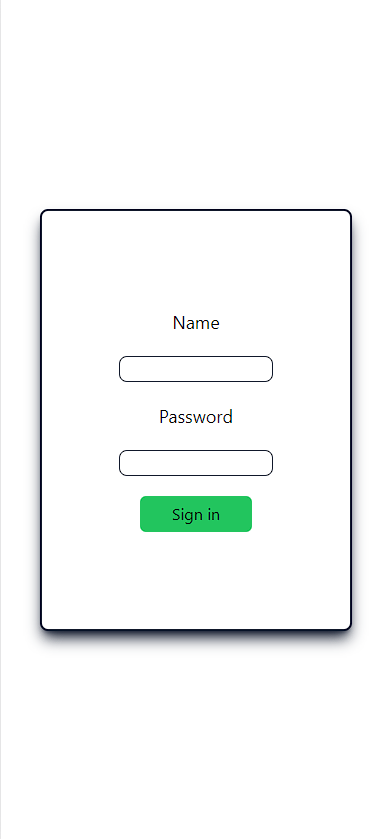

App chưa có chức năng kiểm soát ký tự và tên tài khoản, do vậy người dùng phải nhập chính xác cả chữ in hoa và thường.
Nếu nhập sai, form đăng nhập sẽ hiện thông báo

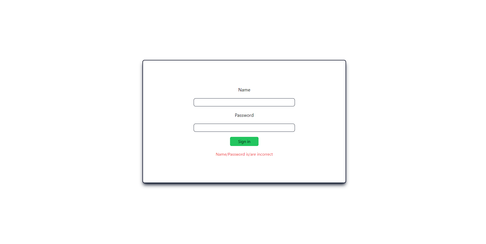

Khi nhập trong ô, người dùng có dùng phím enter thay cho nút "Sign in"

### Trang làm việc chính

Giao diện trên máy tính

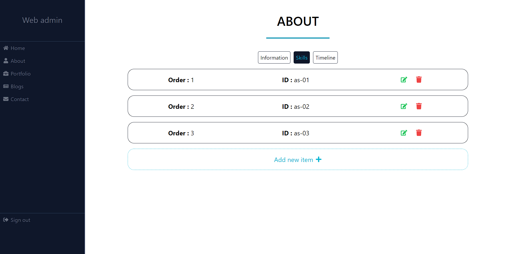

Giao diện trên điện thoại

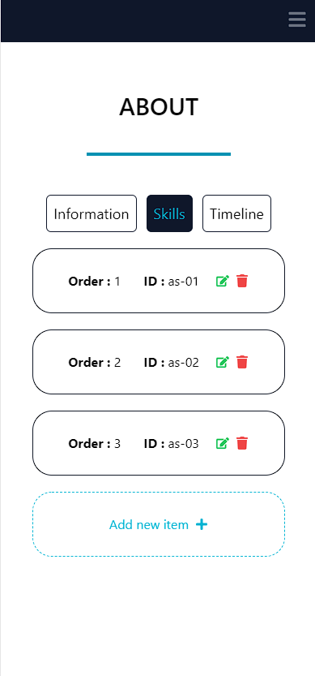

Giao diện trên điện thoại khi mở sidebar

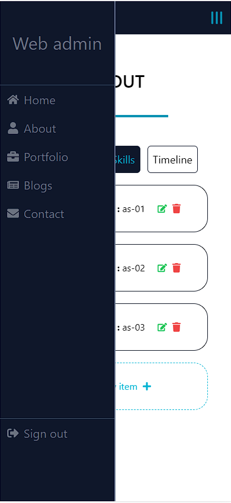

Giao diện luôn có 2 thành phần chính là phần hiển thị danh sách dữ liệu và sidebar để di chuyển qua lại giữa các danh sách. Trên điện thoại sẽ có thêm navbar và nút menu để bật tắt sidebar. Cả sidebar và navbar đều có css position: fixed để tạo thuận tiện cho người dùng.
Bên cạnh đó, side bar còn cho phép ta điều thực hiện chức năng đăng xuất, khi nhấn nút đăng xuất sẽ hiện 1 bảng xác nhận hành động

Tại phần hiển thị danh sách, trên cùng sẽ hiện tên mục của danh sách, riêng mục About sẽ có các nút chuyển qua lại giữa các mục con.
Một số danh sách có chức năng thêm thành phần sẽ có nút thêm ở dưới cùng, khi nhấn sẽ chuyển đển trang chi tiết thành phần (sẽ đề cập ngay sau đây). Trên mỗi thành phần đều có nút chỉnh sửa màu xanh lá, khi click sẽ chuyển đến trang chỉnh sửa. Một số sẽ nút màu đỏ tương ứng với chức năng xóa. Khi nhấn sẽ hiện thông báo xác nhận, ghi rõ ID của thành phần sẽ xóa

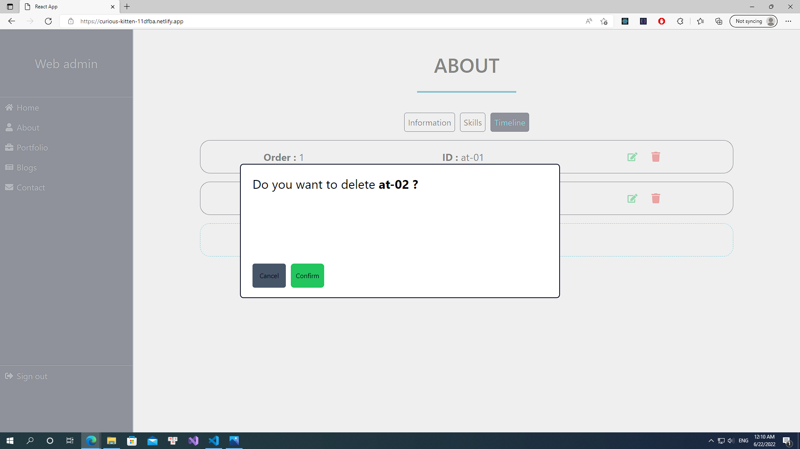

### Trang chi tiết thành phần

Trang này sẽ đảm nhận 3 chức năng : đọc, cập nhật và tạo.

Khi nhấn nút chỉnh sửa ở trang chính, nó sẽ trả về trang chi tiết thành phần như sau

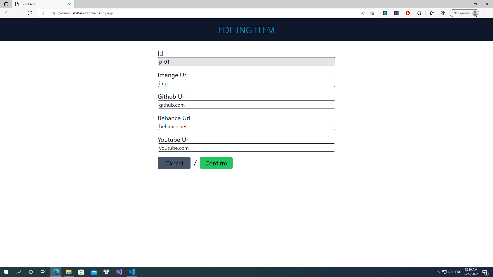

Người thể đọc được thông tin chi tiết của mỗi thành phần, có thể quay về với nút "cancel" hoặc thực hiện chỉnh sửa thông tin và nhấn nút "confirm" để xác nhận việc cập thông tin. Tuy nhiên, người dùng ko thể thay đổi ID.

Với chức năng thêm, trang sẽ hiện thông tin trống, người dùng nhấn "confirm" để thêm

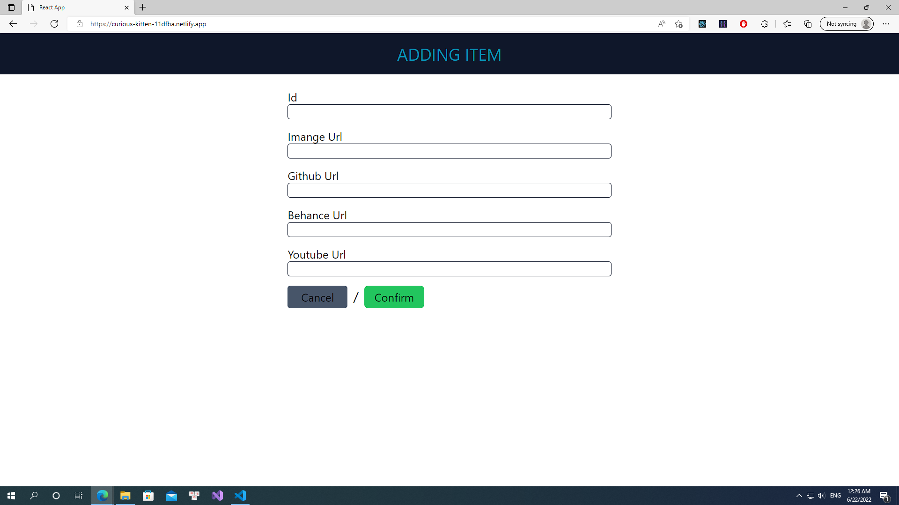

Tuy nhiên, nếu người dùng nhập 1 ID đã có sẵn, app sẽ bắt lỗi, thông báo và tạm dừng chức năng thêm thành phần
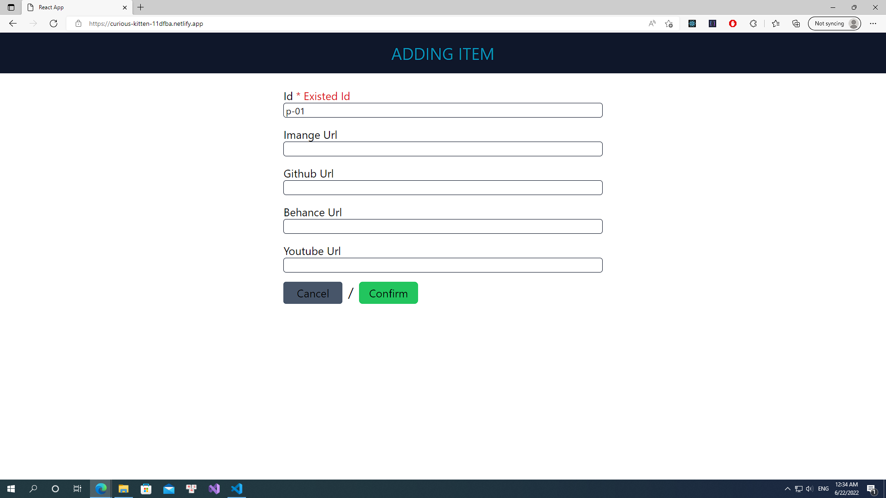
